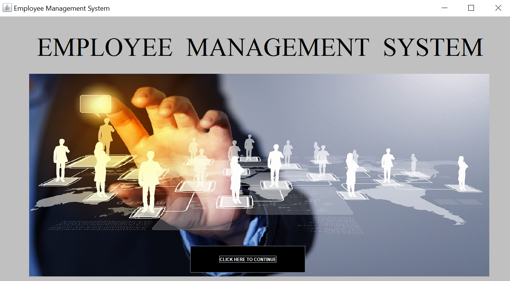
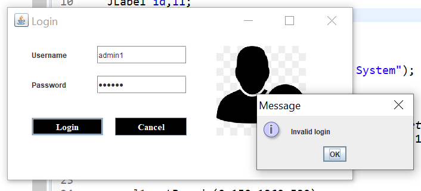
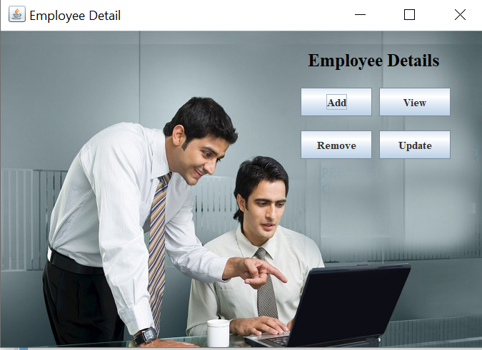

# Employee-Management-System
A java based backend project which maintains the information about the personal details of employees.
Technologies used : java, swing, tomcat, mysql, Eclipse.

<body>
 <h3>Working-></h3>
 
1. First, a Welcome page will open and will redirect to the login page

 </img>
  
 
2. Login page will open and if you enter wrong username or password it will show alert.

 </img>
  
 
3. Now the admin can perform these functions ie. view, add, update and delete

 </img>
 </body>
 

<h2>Database Commands-></h2>
create table login(username varchar(20), password varchar(20));

create table employee(name varchar(25), fname varchar(30), age varchar(10), dob varchar(20), address varchar(50), phone varchar(20), email varchar(30), education varchar(15), post varchar(15), aadhar varchar(20), emp_id varchar(10));
